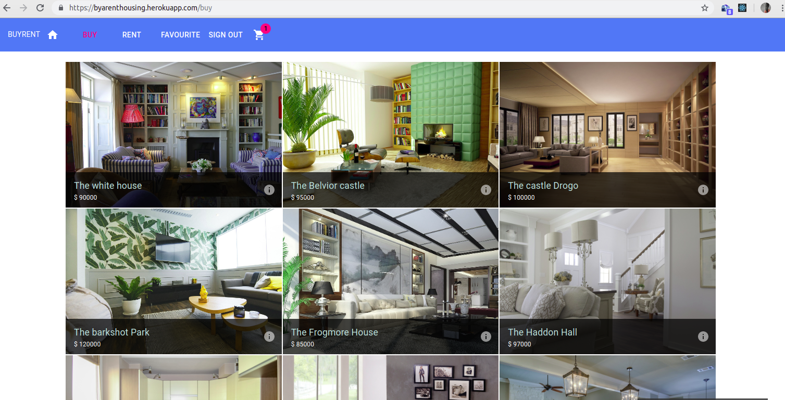

# graduateProjectOutbox

## MERN BYARENT project

An online house browsing application with user accounts, houses for rent and sale, shopping cart and order management, developed using React, Node, Express and MongoDB.

[###Live Demo](https://byarenthousing.herokuapp.com/) 

####What You need to Run this App
1. Node (>8.11.1)
2. NPM (>5.8.0)
3. MongoDB (>3.6.3)

####How to run this app
1. Install mongodb and make sure it's running on your system
2. Clone this repository
3. Open Command line and cd into the Repo
 * Install dependencies by executing npm install
 * To run the application for development, execute npm run development
4 Open  in your Browser
